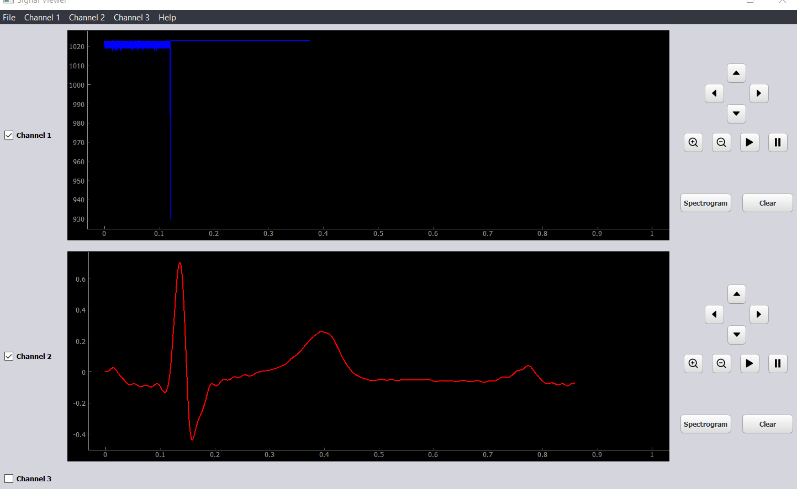
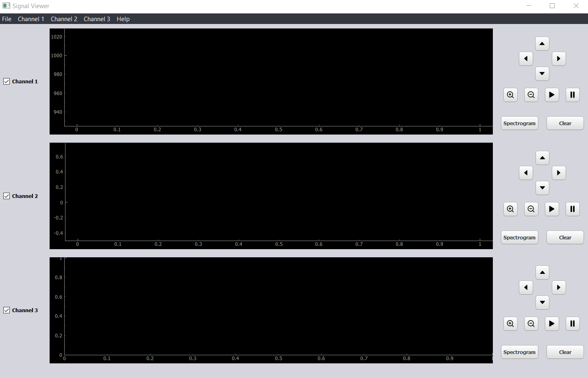
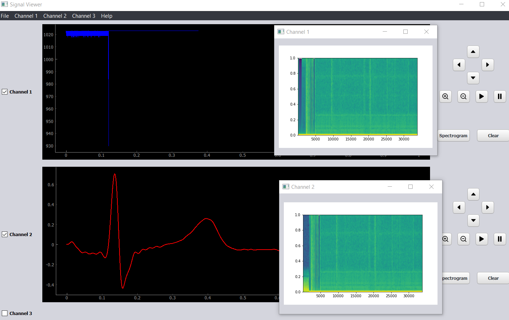

# Signal Viewer
## Description
 this is desktop app used to view the signal in a real time series with its spectrogram
 with some features which is :
## Features
- 3 real time signal viewer  
- pop up spectrogram for this signal
- moving arrow for the signal the signal
-  pause and play
- zoom in & out
## Python_packages  :
- PyQt5.QtWidgets
- PyQt5.uic
- pyqtgraph
- datetime
- shutil

## Screenshots:

